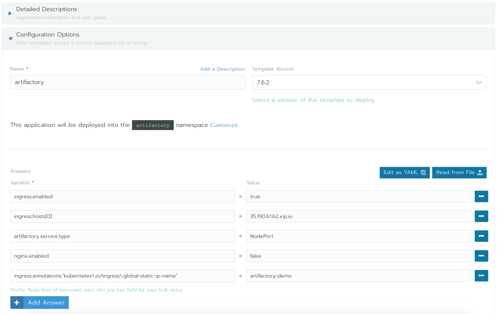
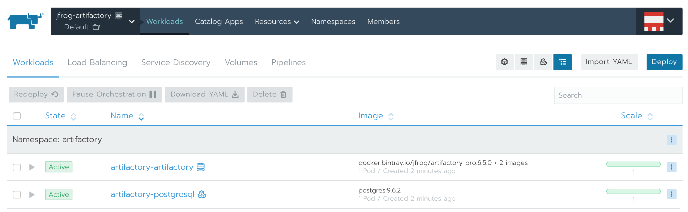
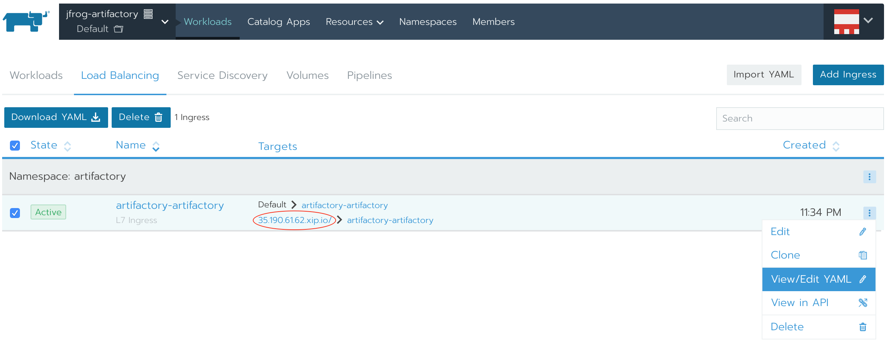
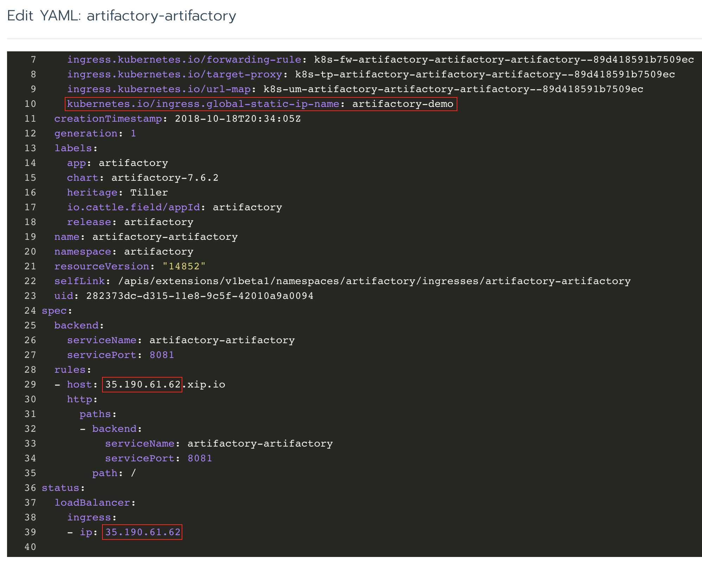
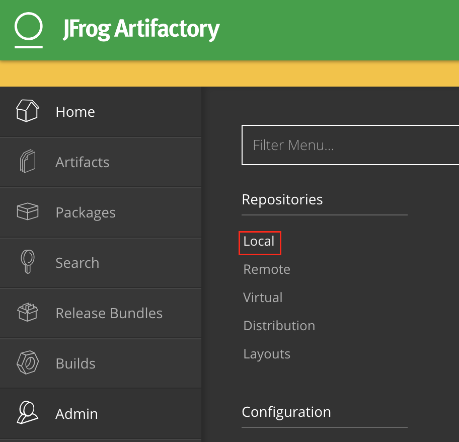
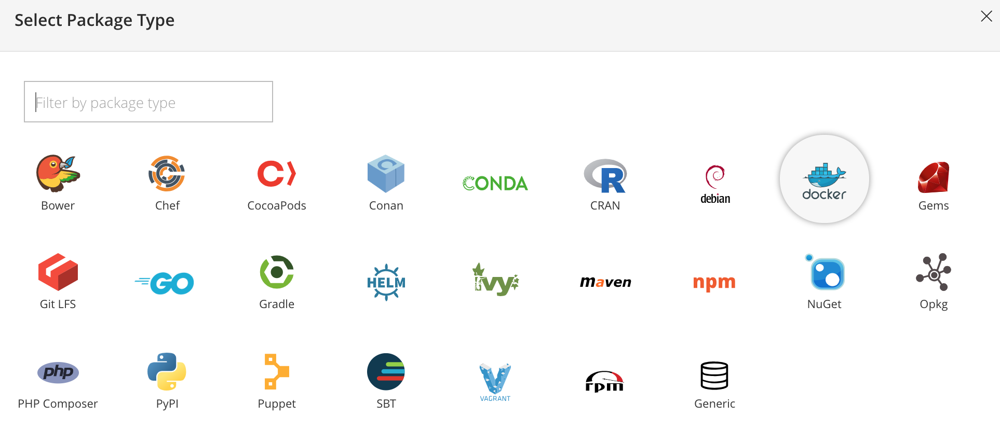
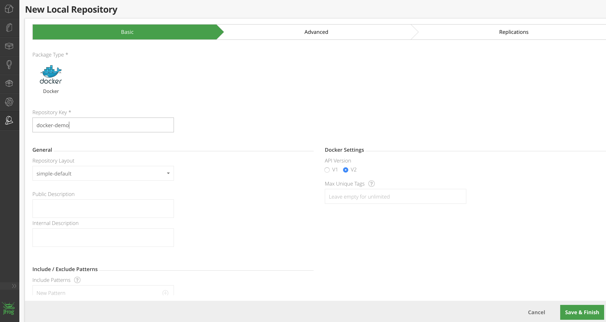
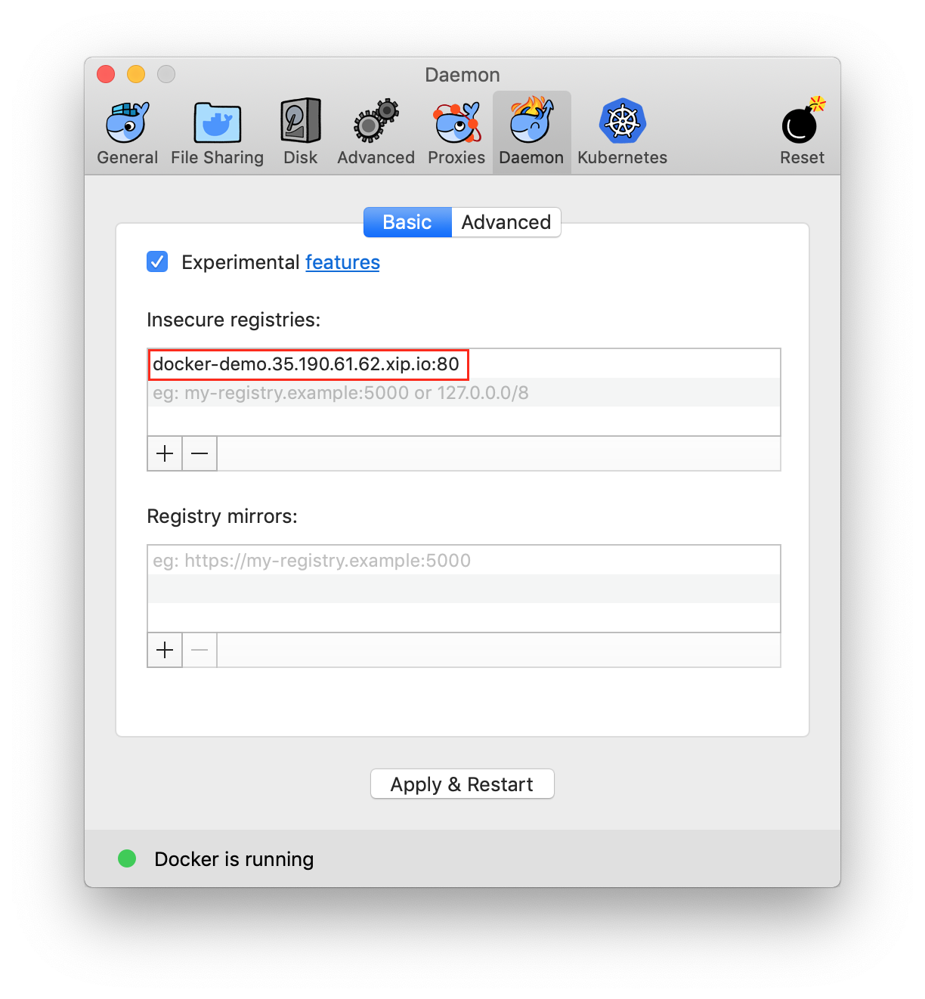
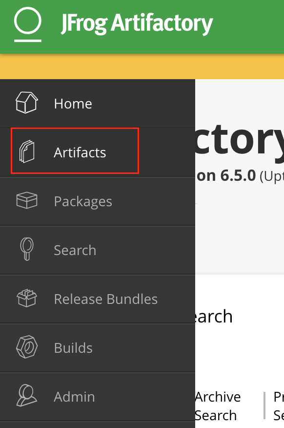
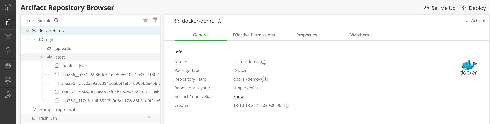

# **Using JFrog Artifactory as Docker Image Repository**

This article is a continuation of [Deploying JFrog Artifactory with Rancher](https://github.com/roma-d/jfrog-artifactory-with-rancher). Here you will see how you can use JFrog Artifactory as a private Docker Image Repository for your container images, and use them with Docker.

To create a Docker Image Repository, you will need a licensed JFrog Artifactory. They offer 30 days trial license, you can get one [here](https://jfrog.com/artifactory/free-trial/). The **License Key** will be sent via email, make sure to save it, as you will need it later.

#### **Getting a public static IP address**

To use artifactory as a docker registry, you will need a public IP address. And it will be useful to have that IP address before the actual deployment, so you can assign it to Artifactory's frontend.

To reserve a public IP address run the following command from [Google Cloud Shell](https://cloud.google.com/shell/), or from your local `gcloud` environment:

```
gcloud compute addresses create artifactory-demo --global
```

Take note of the name, here it is `artifactory-demo`. And then retrieve the IP address created:

```
gcloud compute addresses describe artifactory-demo --global
```

Take the IP address from the output, in this example it's `35.190.61.62`:

```
address: 35.190.61.62
...
```

You will use the `xip.io` service for this demo, you will configure artifactory to use `35.190.61.62.xip.io` as a hostname, that will resolve to the IP address you just reserved. Make sure to use the IP address from your output instead of 35.190.61.62.

#### Deploying Artifactory

To deploy JFrog artifactory and use it as a Docker Registry, follow the steps described in [this](https://github.com/roma-d/jfrog-artifactory-with-rancher) article, up until the configuration of the variables in `Catalog Apps`. Here you will have to change the variables used, namely the following variables and values:
- set the variable `ingress.enabled` to value `true`;
- set the variable `ingress.hosts[0]` to value `35.190.61.62.xip.io`;
- set the variable `artifactory.service.type` to value `NodePort`;
- set the variable `nginx.enabled` to value `false`;
- set the variable `ingress.annotations."kubernetes\.io/ingress\.global-static-ip-name"` to value `artifactory-demo`.

It should look like in the below image:



Now let's explain what those variables mean:
- `ingress.enabled=true` - enables the creation of [ingress](https://kubernetes.io/docs/concepts/services-networking/ingress/) kubernetes object, in this case it will serve as a proxy for artifactory;
- `ingress.hosts[0]=35.190.61.62.xip.io` - this one sets the hostname for artifactory, as discussed previously, when you reserved the public IP address with `gcloud`. It will allow us to create any subdomain, like `docker-demo.35.190.61.62.xip.io`, that will resolve back to Artifactory IP address, in this case 35.190.61.62 (make sure to use your IP address);
- `artifactory.service.type=NodePort` - this exposes Artifactory's service to a random port on the Kubernetes nodes, from there, `ingress` object knows to route the traffic to that random port;
- `nginx.enabled=false` - as you're using now `ingress` kubernetes object, there's no need for another nginx proxy, thus it is disabled;
- `ingress.annotations."kubernetes\.io/ingress\.global-static-ip-name"=artifactory-demo` - this is the glue part, that ties Kubernetes to the static public IP address you reserved earlier to the `ingress` object. Notice that the variable value is the name of the public IP address you reserved, in this case it is `artifactory-demo`. This will ensure that `ingress` uses that particular IP address.

Now click `Launch`!

#### **Verifying what was deployed**

After several minutes, Rancher will deploy all the objects to Kubernetes, with the specified changes. If you click on `Workloads` tab, you should see 2 workloads, one is the application `artifactory-artifactory` and the other one is the postgresql database `artifactory-postgresql`:



The important part to verify here is on the `Load Balancing` tab, click that. You should see the `ingress` kubernetes object created, with the hostname we provided:



Now to check that the IP address you reserved, was actually used by `ingress` kubernetes object, select `View/Edit YAML` from the right-hand side menu, as seen in the image above. If you scroll to the bottom, you should see something like this:



The first thing to notice is the annotation that you added, that glued the public IP address reserved with `gcloud` to the `ingress` kubernetes object:

```
kubernetes.io/ingress.global-static-ip-name: artifactory-demo
```

Next, notice that the IP address from the `spec.rules.host` is the same with the IP address from `status.loadBalancer.ingress.ip`, this means that everything was deployed correctly.

Close the edit window by clicking on `Cancel`.

#### **Configuring Artifactory**

After you closed the `View/Edit YAML` window from previous step, you should be back at the `Load Balancing` tab, where you have the `xip.io` clickable URL, click on that, to open Artifactory in a new browser tab.

You should see the welcome message from the Artifactory setup wizard. The first step, is just a welcome message, so you can simply click on `Next`.

On the next screen it will ask for Artifactory License Key, this is the trial key that you received by email. Once you pasted the key there, click `Next`.

Set an admin password for Artifactory and remember it, as you will use it later.

After you've set the admin password, all the other steps can be skipped, until you finished the setup wizard.

Now it's time to create your own Docker Registry. To do that, on the left-hand side menu, select `Admin` and then, under `Repositories` click on `Local`:



You should have there one generic repository already created, that one was created during the setup wizard steps by default.

On the upper right corner, click on `+ New` to create a new repository. You will be presented with repository package type, choose `Docker` there:



After this, the only thing left is to set the `Repository Key`, lets set it to `docker-demo` for example. Leave everything else by default and click on `Save & Finish`:



At this point, you have your docker registry running at the follwing URL: `docker-demo.35.190.61.62.xip.io` (the IP address in the middle will be different in your case).

#### **Test Docker Registry**

Now, for the fun part, let's test the newly created Docker Registry :)

The Docker Registry that you just configured isn't secured, to secure it you need a public domain and a SSL certificate, and this is beyond the scope of this article. To use this newly created Docker Registry, you need to add it to docker `insecure-registry` configuration (because it's not secured). Basically you need to change the `daemon.json` file, whose default location is `/etc/docker/daemon.json` on Linux or `C:\ProgramData\docker\config\daemon.json` on Windows Server. If you use Docker for Mac or Docker for Windows, click the `Docker` icon, choose `Preferences`, and choose `+Daemon`.

If the `daemon.json` file does not exist, create it. Assuming there are no other settings in the file, it should have the following contents (change with your URL, that has your IP in it):

```
{
  "insecure-registries" : ["docker-demo.35.190.61.62.xip.io:80"]
}
```

Here's a screenshot from Docker for Mac:



Once you have the secure registry added to `daemon.json` file, you need to restart docker, to apply the changes.

After docker restarts, you can login to the newly created Docker Registry and `push / pull` containers ;)

Run the following command to login (set your IP as REGIP below):

```
export REGIP="35.190.61.62"
docker login -u admin -p <YOUR_PASSWORD> docker-demo.$REGIP.xip.io:80
```

Expected output:

```
Login Succeeded
```

Now, lets pull a public container, change it's tag, and push it to your Docker Registry. For this run the following commands:

```
$ docker pull nginx
Using default tag: latest
latest: Pulling from library/nginx
f17d81b4b692: Pull complete
d5c237920c39: Pull complete
a381f92f36de: Pull complete
Digest: sha256:b73f527d86e3461fd652f62cf47e7b375196063bbbd503e853af5be16597cb2e
Status: Downloaded newer image for nginx:latest
```

this one will pull the `nginx` docker image locally. Check the images you have:

```
$ docker images
REPOSITORY          TAG                 IMAGE ID            CREATED             SIZE
nginx               latest              dbfc48660aeb        2 days ago          109MB
```

to push this image to your Docker Registry, you need to tag it appropriately:

```
$ docker tag nginx docker-demo.$REGIP.xip.io:80/nginx:latest
```

now you can push it:

```
$ docker push docker-demo.$REGIP.xip.io:80/nginx:latest
The push refers to repository [docker-demo.35.190.61.62.xip.io:80/nginx]
86df2a1b653b: Pushed
bc5b41ec0cfa: Pushed
237472299760: Pushed
latest: digest: sha256:d98b66402922eccdbee49ef093edb2d2c5001637bd291ae0a8cd21bb4c36bebe size: 948
```

Let's see how it looks from Artifactory WebUI, go back to your browser and select `Artifacts` from Artifactory's menu:



There you should see the image you just pushed and all the hashes of the layers that compose the image and details about them:



With this, we can conclude the demo of a Docker Registry running on Artifactory. For a production set up you need to add a public domain and a SSL certificate, then you can use your private Docker Registry with your Kubernetes Cluster and deploy your private images to your cluster.

#### **Cleanup**

To clean the resources used for this article you need to delete the Kubernetes cluster from Rancher, and then to delete the rancher instance:

```
gcloud compute --project=rancher-20 instances delete rancher-instance --zone=europe-west2-c
```

Also remove the static public IP address reservation:

```
gcloud compute addresses delete artifactory-demo --global
```

#### **Some final thoughts**

Jfrog Artifactory provides multiple functionalities that are at the center of a development lifecycle. You can store and retrieve almost any type of artifacts produced by your development teams, and this fact makes Artifactory a very important part of your IT infrastructure.

By using **Rancher** you were able to deploy Artifactory in several minutes. It took longer to actually configure Artifactory, inside Artifactory, than to deploy it with **Rancher** to a Kubernetes Cluster, and you are able to see and monitor all of the resources consumed by Artifactory, from the Rancher dashboard, and that is very convenient.

Thank you for your time and I hope this article was useful.
